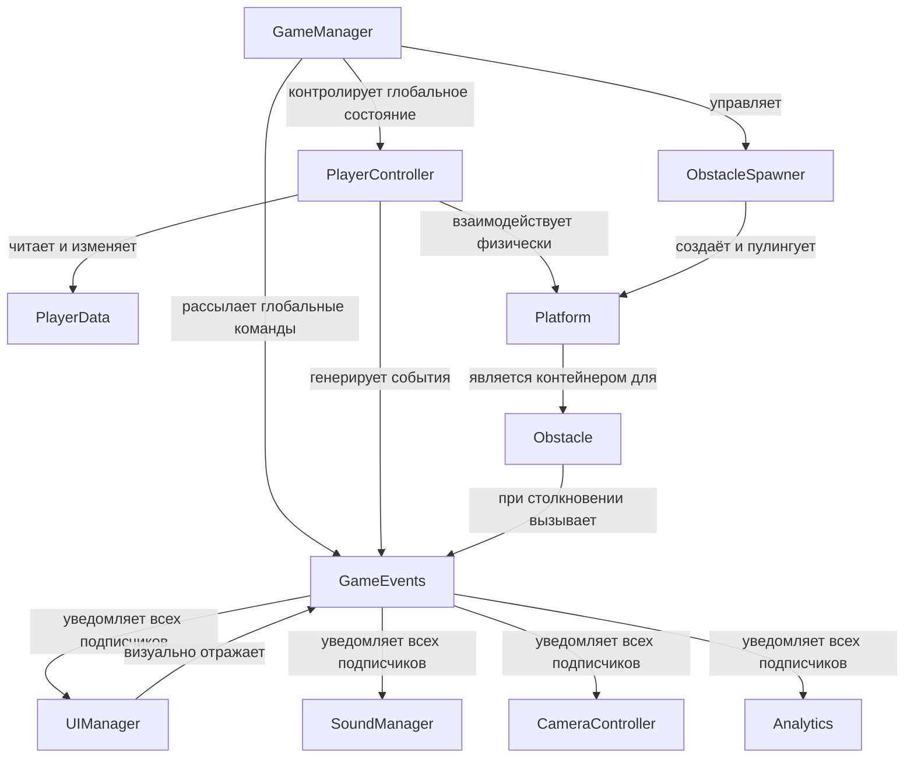
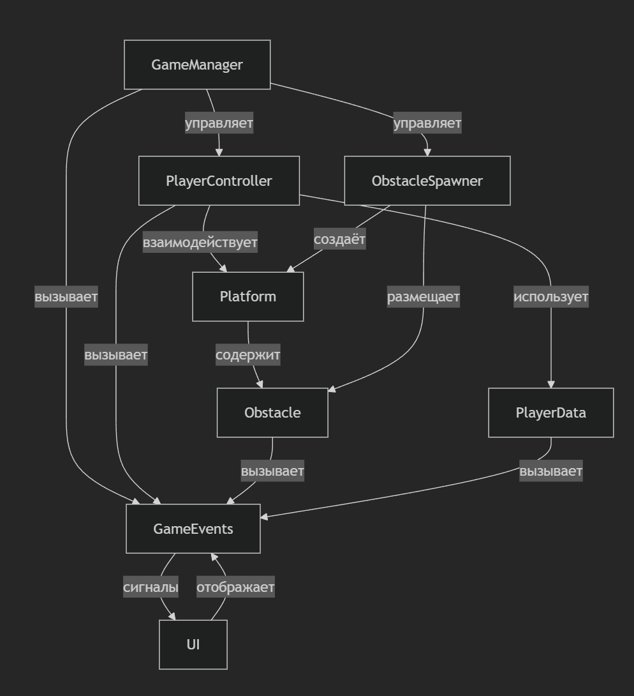

## 1. Цели и стратегические задачи проекта

Проект **Unity Runner** задумывался и реализовывался не просто как очередная игра в популярном жанре бесконечного раннера, а как демонстрационная площадка, на которой можно наглядно показать, как в 2025–2026 годах следует выстраивать современные, поддерживаемые и легко расширяемые проекты на Unity.

Основные цели, которые ставились перед проектом с самого начала:

- Создать **чётко структурированную, модульную архитектуру**, в которой каждый компонент выполняет строго ограниченный круг задач  
- Обеспечить **высокую степень масштабируемости** — чтобы добавление новых механик, типов препятствий, биомов, персонажей или систем монетизации не требовало глобального рефакторинга  
- Внедрить **полноценную событийную систему** как основной механизм коммуникации между частями игры, минимизируя жёсткие зависимости  
- Полностью перейти на **data-driven подход** — максимальное количество параметров и правил поведения должно находиться вне кода, в ScriptableObject-активах  
- Добиться **приятного и отзывчивого UX** даже при высоких скоростях и на мобильных устройствах  
- Поддерживать **кросс-платформенность** (мобильные устройства + ПК) с минимальными изменениями в коде и ресурсах

## 2. Организация структуры проекта

Проект тщательно организован по принципу **разделения ответственности** и логической группировки ассетов. Ниже приведено подробное описание основных директорий и их предназначения:

- **Configuration**  
  Центральное хранилище всех игровых настроек в виде ScriptableObject. Здесь находятся профили игрока, кривые сложности, таблицы вероятностей появления препятствий, параметры анимаций и т.д.

- **EffectTexturesAndPrefabs**  
  Коллекция визуальных и звуковых эффектов: системы частиц, trail-рендеры, взрывы, сбор монет, получение урона, death-анимации и прочие элементы, отвечающие за «вау-эффект».

- **Fantasy Skybox FREE**  
  Качественный набор skybox-ов, создающий атмосферный фон. В дальнейшем планируется динамическая смена неба в зависимости от набранного расстояния или выбранного биома.

- **Plugins**  
  Внешние библиотеки, без которых современный проект уже сложно представить. В первую очередь — **DOTween Pro / Free**, обеспечивающий подавляющее большинство анимаций в игре.

- **Prefabs**  
  Готовые к использованию строительные блоки: платформы разных типов, препятствия (статичные, движущиеся, разрушаемые), собираемые объекты, эффекты, UI-элементы.

- **Resources** / **Addressables** (в планах)  
  Активы, которые могут подгружаться динамически во время игры.

- **Scenes**  
  Основные сцены проекта: главная меню, игровая сцена, экраны загрузки, отладочные сцены для тестирования отдельных систем.

- **Scripts**  
  Самая важная папка, организованная по доменам ответственности:  
  • Configs  
  • Core (GameManager, Bootstrap, ServiceLocator)  
  • Input  
  • Player  
  • UI  
  • World / LevelGeneration  

- **Settings**  
  Профили качества, URP/HDRP-настройки, платформо-зависимые пресеты.

- **TextMesh Pro**  
  Шрифты, стили, иконки и спрайт-ассеты для современного и читаемого интерфейса.

## 3. Архитектура системы и взаимодействие компонентов

### Высокоуровневая схема связей

### Краткое описание ключевых классов

- **GameManager** — «мозг» игры. Отвечает за состояния (Menu / Countdown / Playing / Paused / GameOver), глобальную скорость, подсчёт очков, рестарт.  
- **PlayerController** — сердце геймплея. Обрабатывает ввод, кинематическое движение вперёд, DOTween-анимации прыжков и смены полос, детекцию столкновений.  
- **PlayerData** — модель данных игрока (здоровье, неуязвимость, собранные монеты, состояние «жив/мёртв»).  
- **ObstacleSpawner / WorldManager** — система процедурной генерации. Создаёт, размещает, перемещает и уничтожает платформы и препятствия.  
- **GameEvents** — статический класс-событийная шина. Единственная точка коммуникации между почти всеми системами.  
- **UIManager / HUD** — реактивный интерфейс, полностью подписанный на события.

## 4. Основные игровые процессы и их последовательность

### Типичный жизненный цикл одной игровой сессии

1. **Запуск и инициализация**  
   Автоматическая загрузка конфигов → создание пулов объектов → спавн стартовых платформ → позиционирование игрока → обратный отсчёт 3-2-1-Go.

2. **Активная фаза игры**  
   - Постоянное движение вперёд с нарастающей скоростью  
   - Динамическая генерация новых секций мира впереди игрока  
   - Удаление отработанных платформ позади (экономия памяти)  
   - Реакция на ввод: смена полосы (3–5 полос), прыжок, приседание/скольжение  
   - Сбор монет и бонусов → временные множители очков  
   - Столкновения → потеря здоровья → короткий период неуязвимости + визуальный фидбек

3. **Критические события**  
   - Получение урона → тряска камеры, звук, мигание экрана  
   - Смерть → замедление времени → показ финального экрана → автоматический рестарт через 2–4 секунды

4. **Синхронизация мира и игрока**  
   Все платформы и препятствия движутся навстречу игроку с той же скоростью, что и глобальная скорость игры → ощущение движения создаётся именно так, а не за счёт перемещения самого персонажа.

## 5. Используемый технологический стек

- **Unity** 2022 LTS / 2023 LTS / Unity 6 (в планах)  
- **Universal Render Pipeline (URP)** — основной рендер  
- **DOTween** (free/pro) — 95% всех анимаций и переходов  
- **C#** + современные возможности языка (records, pattern matching, source generators в планах)  
- **ScriptableObject** как основа data-driven дизайна  
- **Object Pooling** (встроенный в ObstacleSpawner)  
- **TextMesh Pro** + Canvas Scaler (адаптивный UI)  
- **Mermaid** для документации архитектуры

## 6. Выводы и перспективы развития

На текущий момент **Unity Runner** представляет собой качественный пример того, как должен выглядеть хорошо спроектированный мобильный/ПК раннер в 2026 году.

Проект демонстрирует:

- Чёткое разделение ответственности  
- Минимизацию прямых зависимостей через событийную шину  
- Полный контроль над параметрами через ScriptableObject  
- Приятный и отзывчивый геймплей даже на высоких скоростях  
- Готовность к быстрому добавлению нового контента (скины, биомы, power-up’ы, ежедневные испытания, сезонные события)

В ближайших итерациях планируется:

- Переход на **Addressables** для динамической загрузки контента  
- Добавление **скинов персонажей** и **кастомизации**  
- Внедрение **системы достижений** и **лидербордов**  
- Эксперименты с **новыми механиками** (магнит, реактивный ранец, замедление времени, мультипликаторы)  
- Оптимизация под слабые мобильные устройства  
- Локализация и поддержка разных языков

Unity Runner уже сейчас может служить отличной базой как для коммерческого проекта, так и для обучения команды современным практикам разработки на Unity.

