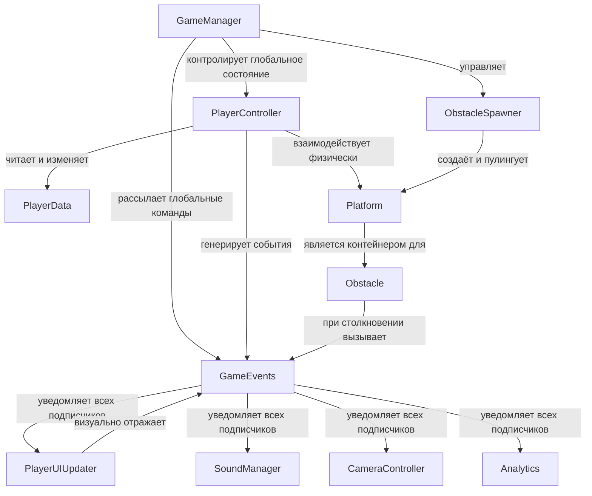
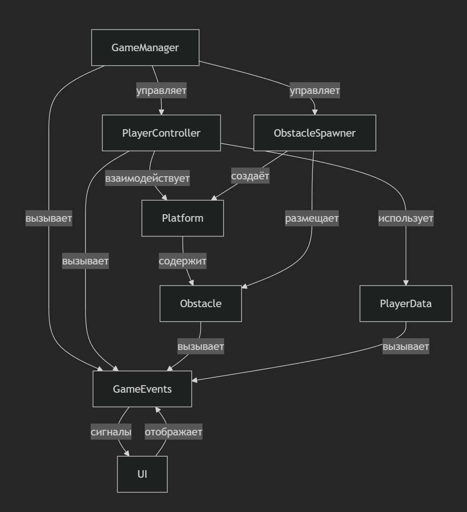

## 1. Цели и стратегические задачи проекта

Проект **Unity Runner** задумывался и реализовывался не просто как очередная игра в популярном жанре бесконечного раннера, а как демонстрационная площадка, на которой можно наглядно показать, как в 2025–2026 годах следует выстраивать современные, поддерживаемые и легко расширяемые проекты на Unity.

**Итерация HA_2:** в одной сцене (`SampleScene`) реализованы меню, игра, пауза и game over, система бонусов на `ScriptableObject`, сохранение high score (`PlayerPrefs`), расширенный HUD и простой визуальный фидбек (DOTween / цвет). Подробнее для сдачи задания см. корневой `README.md` репозитория.

Основные цели, которые ставились перед проектом с самого начала:

- Создать **чётко структурированную, модульную архитектуру**, в которой каждый компонент выполняет строго ограниченный круг задач  
- Обеспечить **высокую степень масштабируемости** — чтобы добавление новых механик, типов препятствий, биомов, персонажей или систем монетизации не требовало глобального рефакторинга  
- Внедрить **полноценную событийную систему** как основной механизм коммуникации между частями игры, минимизируя жёсткие зависимости  
- Полностью перейти на **data-driven подход** — максимальное количество параметров и правил поведения должно находиться вне кода, в ScriptableObject-активах  
- Добиться **приятного и отзывчивого UX** даже при высоких скоростях и на мобильных устройствах  
- Поддерживать **кросс-платформенность** (мобильные устройства + ПК) с минимальными изменениями в коде и ресурсах

## 2. Организация структуры проекта

Проект тщательно организован по принципу **разделения ответственности** и логической группировки ассетов. Ниже приведено подробное описание основных директорий и их предназначения:

- **Configuration**  
  Центральное хранилище всех игровых настроек в виде ScriptableObject. Здесь находятся профили игрока (`PlayerData`), конфиг препятствий и платформ (`ObstacleConfig`, включая шанс и префабы бонусов), определения пикапов (`BonusData`: лечение, неуязвимость) и т.д.

- **EffectTexturesAndPrefabs**  
  Коллекция визуальных и звуковых эффектов: системы частиц, trail-рендеры, взрывы, сбор монет, получение урона, death-анимации и прочие элементы, отвечающие за «вау-эффект».

- **Fantasy Skybox FREE**  
  Качественный набор skybox-ов, создающий атмосферный фон. В дальнейшем планируется динамическая смена неба в зависимости от набранного расстояния или выбранного биома.

- **Plugins**  
  Внешние библиотеки, без которых современный проект уже сложно представить. В первую очередь — **DOTween Pro / Free**, обеспечивающий подавляющее большинство анимаций в игре.

- **Prefabs**  
  Готовые к использованию строительные блоки: платформы разных типов, препятствия (статичные, движущиеся, разрушаемые), собираемые объекты, эффекты, UI-элементы.

- **Resources** / **Addressables** (в планах)  
  Активы, которые могут подгружаться динамически во время игры.

- **Scenes**  
  Текущая сборка: одна сцена `SampleScene` — в ней же главное меню, геймплей, пауза и game over (без отдельной menu-scene). Дополнительные сцены возможны для отладки.

- **Scripts**  
  Самая важная папка, организованная по доменам ответственности:  
  • Configs  
  • Core (GameManager, Bootstrap, ServiceLocator)  
  • Input  
  • Player  
  • UI  
  • World / LevelGeneration  

- **Settings**  
  Профили качества, URP/HDRP-настройки, платформо-зависимые пресеты.

- **TextMesh Pro**  
  Шрифты, стили, иконки и спрайт-ассеты для современного и читаемого интерфейса.

## 3. Архитектура системы и взаимодействие компонентов

### Высокоуровневая схема связей

```mermaid
graph TD
    GameManager -->|контролирует глобальное состояние| PlayerController
    GameManager -->|управляет| ObstacleSpawner
    GameManager -->|рассылает глобальные команды| GameEvents
    
    PlayerController -->|читает и изменяет| PlayerData
    PlayerController -->|взаимодействует физически| Platform
    PlayerController -->|генерирует события| GameEvents
    
    ObstacleSpawner -->|создаёт и пулингует| Platform
    Platform -->|является контейнером для| Obstacle
    Obstacle -->|при столкновении вызывает| GameEvents
    
    GameEvents -->|уведомляет всех подписчиков| PlayerUIUpdater
    GameEvents -->|уведомляет всех подписчиков| SoundManager
    GameEvents -->|уведомляет всех подписчиков| CameraController
    GameEvents -->|уведомляет всех подписчиков| Analytics
    
    PlayerUIUpdater -->|визуально отражает| GameEvents
```

### Краткое описание ключевых классов

- **GameManager** — «мозг» игры. Состояния single-scene flow: `MainMenu`, `Playing`, `Paused`, `GameOver`; глобальная скорость и её рост; счёт как время забега; загрузка/сохранение лучшего результата; старт, пауза (ESC), выход в меню, выход из приложения.  
- **PlayerController** — сердце геймплея. Обрабатывает ввод, кинематическое движение вперёд, DOTween-анимации прыжков и смены полос, детекцию столкновений и подбор бонусов через триггеры.  
- **PlayerData** — модель данных игрока (здоровье, временная неуязвимость от бонуса и после урона, применение эффектов из `BonusPickupDefinition`).  
- **HighScoreStorage** — сохранение лучшего счёта в `PlayerPrefs`.  
- **ObstacleSpawner** — процедурная генерация платформ и препятствий, опциональный спавн бонусных пикапов по `ObstacleConfig`.  
- **BonusPickup / BonusPickupDefinition** — префаб пикапа и SO с типом бонуса и числовыми параметрами.  
- **GameEvents** — статический класс-событийная шина (в т.ч. score, high score, пауза, game over, подбор бонуса).  
- **PlayerUIUpdater** — панели меню, HUD, паузы, game over; подписка на `GameEvents` и запросы к `GameManager`.  
- **PlayerVisualFeedback** — краткий визуальный отклик на урон, подбор бонуса и неуязвимость (DOTween).

## 4. Основные игровые процессы и их последовательность

### Типичный жизненный цикл (HA_2, одна сцена)

1. **Запуск**  
   Загрузка `SampleScene` → инициализация спавнера и игрока → `GameManager` показывает главное меню (`Time.timeScale = 1`, мир уже может содержать стартовую раскладку платформ).

2. **Старт забега**  
   По кнопке «Старт» — сброс мира (`GameEvents.InvokeGameReset`, регенерация у `ObstacleSpawner`), обнуление таймера и счёта, переход в `Playing`.

3. **Активная фаза**  
   - Рост скорости игры со временем и рассылка `GameSpeedChanged`  
   - Счёт: целые секунды с начала забега  
   - Генерация платформ впереди, деспавн сзади  
   - Ввод: полосы, прыжок; столкновения с препятствиями и урон, если нет неуязвимости  
   - Подбор бонусов: лечение, временная неуязвимость (данные из SO)

4. **Пауза**  
   Клавиша ESC в `Playing` → `Paused`, `Time.timeScale = 0`; повторный ESC или кнопка «Продолжить» → возврат в игру.

5. **Game over и меню**  
   Смерть игрока → остановка забега, экран результата, обновление high score при рекорде и запись в `PlayerPrefs`. Игрок может начать новый забег или выйти в главное меню (с пересборкой мира при необходимости). Авто-рестарт по таймеру не используется.

6. **Синхронизация мира**  
   Платформы и препятствия движутся навстречу игроку с глобальной скоростью игры.

## 5. Используемый технологический стек

- **Unity** 6 (фактическая версия проекта: **6000.3.9f1**, см. `ProjectSettings/ProjectVersion.txt`)  
- **Universal Render Pipeline (URP)** — основной рендер  
- **DOTween** — анимации переходов и визуальный фидбек  
- **C#**  
- **ScriptableObject** — конфиги игрока, препятствий, определения бонусов  
- **Object Pooling** (в `ObstacleSpawner`)  
- **TextMesh Pro** + Canvas (HUD и меню)  
- **PlayerPrefs** — персистентный high score  
- **Mermaid** для документации архитектуры

## 6. Выводы и перспективы развития

На текущий момент **Unity Runner** закрывает требования **HA_2**: бонусы, UI-поток в одной сцене, сохранение рекорда, визуальный фидбек, документация в `README.md`.

Проект демонстрирует:

- Чёткое разделение ответственности  
- Событийную шину `GameEvents` между геймплеем и UI  
- Data-driven бонусы и конфиг спавна через ScriptableObject  
- Одно-сценовый управляемый поток без конфликта с паузой и меню  

Возможное дальнейшее развитие:

- **Addressables** для контента  
- Отдельные сцены меню / загрузки при росте проекта  
- Скины, достижения, лидерборды, новые типы бонусов  
- Оптимизация и локализация  

Unity Runner может служить базой для коммерческого прототипа или учебного примера архитектуры на Unity 6.

